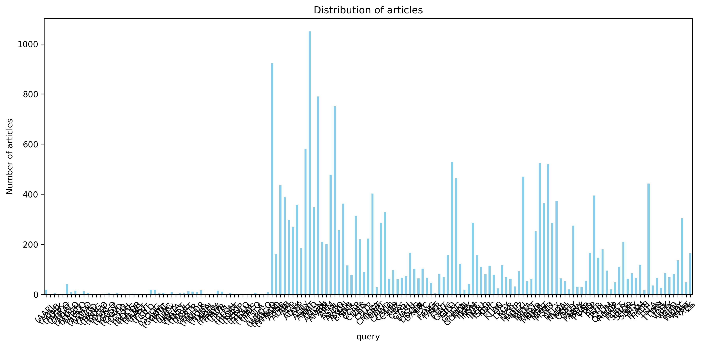
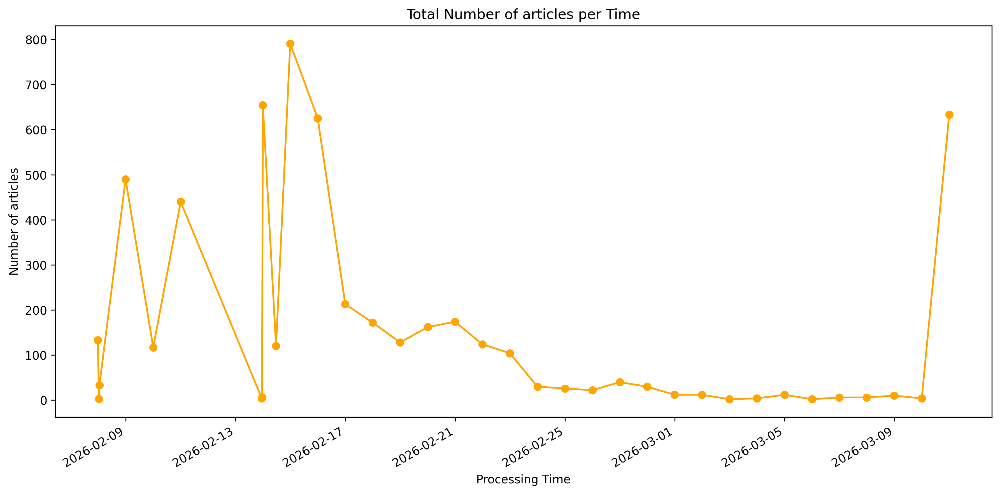
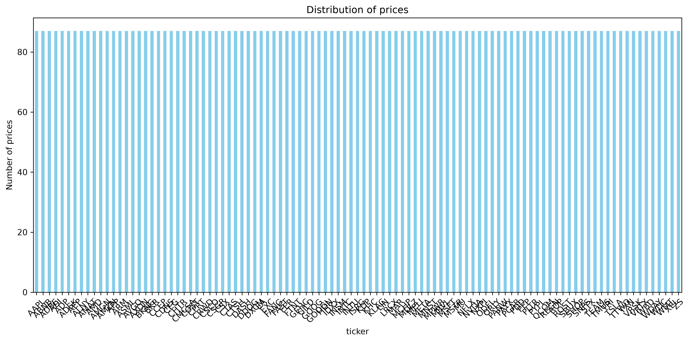
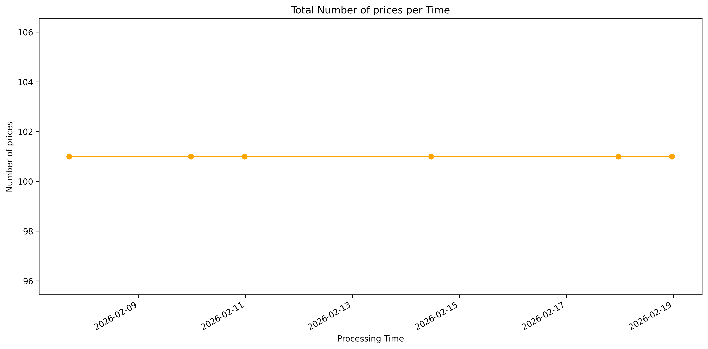
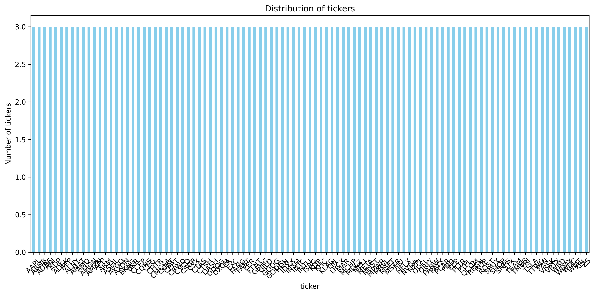
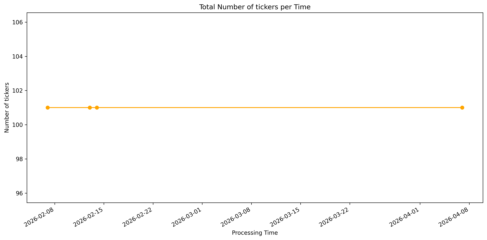

# datasets

[](https://github.com/jtviegas/datasets/actions/workflows/cicd.yml)

[](https://pypi.org/project/tgedr-datasets/)

## datalake pipelines


[](https://github.com/jtviegas/datasets/actions/workflows/tickers.yml)
[](https://github.com/jtviegas/datasets/actions/workflows/prices.yml) 
[](https://github.com/jtviegas/datasets/actions/workflows/articles.yml)


### articles





[download @ hugging face](https://huggingface.co/datasets/jtviegas/ticker_analysis_articles)

### prices





[download @ hugging face](https://huggingface.co/datasets/jtviegas/ticker_analysis_prices)

### tickers





[download @ hugging face](https://huggingface.co/datasets/jtviegas/ticker_analysis_tickers)

## development
- main requirements:
  - _uv_  
  - _bash_
- Clone the repository like this:

  ``` bash
  git clone git@github.com:jtviegas/datasets
  ```
- cd into the folder: `cd datasets`
- install requirements: `./helper.sh reqs`