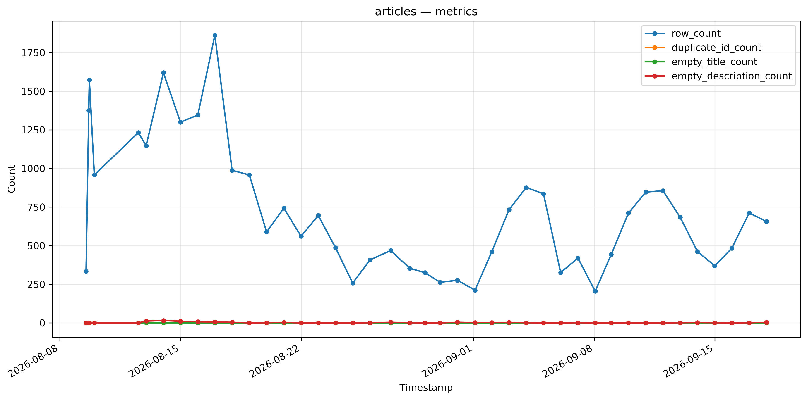
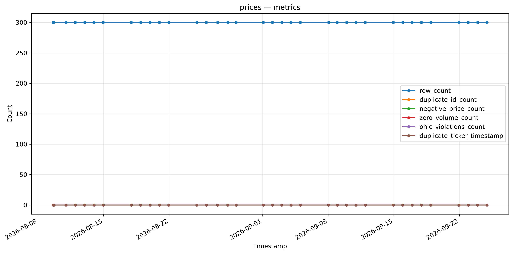
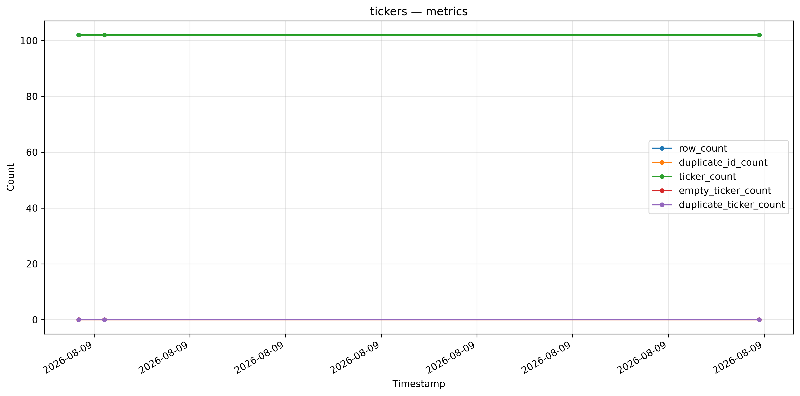

# datasets

[](https://github.com/jtviegas/datasets/actions/workflows/cicd.yml)

[](https://pypi.org/project/tgedr-datasets/)

## motivation

This repository provides a production-grade Python library (`tgedr-datasets`) for building and running automated data pipelines that collect, validate, and store financial market data. It orchestrates the extraction of stock tickers, daily OHLCV prices (via Yahoo Finance), and news articles (via Alpha Vantage, NewsAPI, and Finnhub), transforms them into structured formats, validates them against ODCS data contracts, and loads them into Hugging Face datasets. 

## datalake pipelines


[](https://github.com/jtviegas/datasets/actions/workflows/tickers.yml)
[](https://github.com/jtviegas/datasets/actions/workflows/prices.yml) 
[](https://github.com/jtviegas/datasets/actions/workflows/articles.yml)


### articles

[download @ hugging face](https://huggingface.co/datasets/jtviegas/ticker_analysis_articles)



### prices

[download @ hugging face](https://huggingface.co/datasets/jtviegas/ticker_analysis_prices)



### tickers

[download @ hugging face](https://huggingface.co/datasets/jtviegas/ticker_analysis_tickers)



## development
- main requirements:
  - _uv_  
  - _bash_
- Clone the repository like this:

  ``` bash
  git clone git@github.com:jtviegas/datasets
  ```
- cd into the folder: `cd datasets`
- install requirements: `./helper.sh reqs`